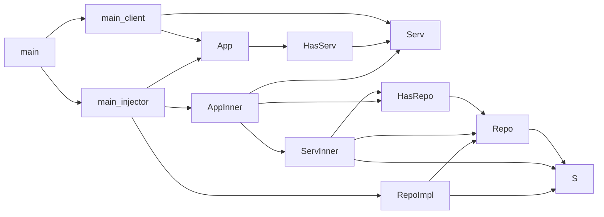

# repo-serv

```mermaid
graph LR
  App --> HasServ
  AppInner --> Serv
  AppInner --> ServInner
  AppInner --> HasRepo
  HasServ --> Serv
  RepoImpl --> Repo
  RepoImpl --> S
  ServInner --> HasRepo
  ServInner --> Repo
  ServInner --> S
  HasRepo --> Repo
  Repo --> S
  main_injector --> App
  main_injector --> AppInner
  main_injector --> RepoImpl
  main_client --> App
  main_client --> Serv
  main --> main_injector
  main --> main_client
```
