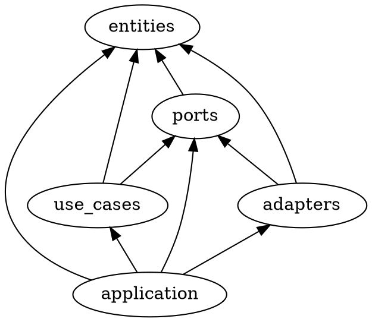

# stamp-rally

## モジュール間の依存関係

(note: trait の default method で use_cases が削除されたため修正する)

## ユースケース

- (WIP) スタンプラリーを作成する (create_stamp_rally)
  - スタンプラリー (StampRally) を作成できる (create_stamp_rally)
  - 将来的に管理者 (Administrator) としてのユーザー (User) を導入する
- 参加する (join)
  - あるユーザー (User) はあるスタンプラリー (StampRally) に参加できる (join)
  - 参加することでユーザー (User) は参加者 (Player) を得られる

## 実装メモ

- DI: Dependency Injection として Cake Pattern を使用する
  - <https://keens.github.io/blog/2017/12/01/rustnodi/>
  - Use Case の "Input Boundary" を trait として提供するつもりだったが
    default method として "Use Case Interactor" を提供できてしまうので兼ねる
    - "Input Boundary" および "Use Case Interactor" は Clean Architecture より。
    - trait <https://doc.rust-lang.org/reference/items/traits.html>
  - adapter のテストで "Input Boundary" が必要な場合には default method を上書きすると良さそう (未検証)
