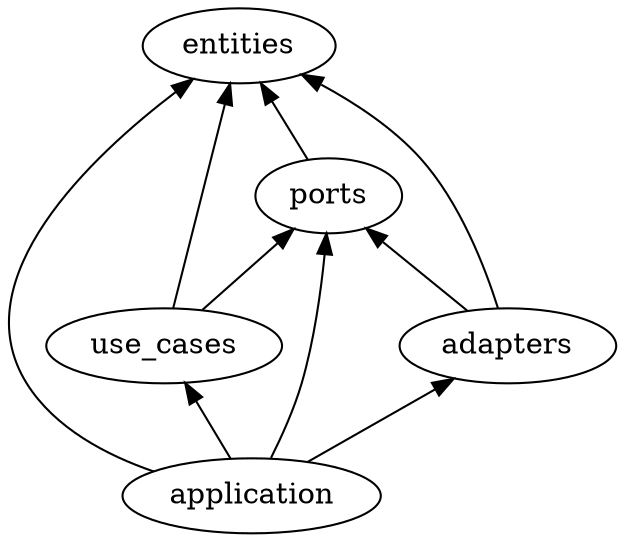

# stamp-rally

## モジュール間の依存関係

(note: trait の default method で use_cases が削除されたため修正する)

## ユースケース

- (WIP) ユーザーを作成する (create)
  - ユーザー (User) を作成できる (create)
- (WIP) スタンプラリーを作成する (create)
  - スタンプラリー (StampRally) を作成できる (create)
  - 将来的に管理者 (Administrator) としてのユーザー (User) を導入し彼らのみが操作できるよう制限する
- スタンプラリーに参加する (join)
  - あるユーザー (User) はあるスタンプラリー (StampRally) に参加できる (join)
  - 参加することでユーザー (User) は参加者 (Player) を得られる
- スタンプカードを発行する (issue)
  - あるスタンプラリー (StampRally) はスタンプカード (StampCard) を発行できる (issue)
  - (WIP) スタンプラリーごとのスタンプカードの発行枚数には上限がある

## 集約

- Player
- StampCard
- StampRally
- User

## 実装メモ

- DI: Dependency Injection として Cake Pattern を使用する
  - <https://keens.github.io/blog/2017/12/01/rustnodi/>
  - Use Case の "Input Boundary" を trait として提供するつもりだったが
    default method として "Use Case Interactor" を提供できてしまうので兼ねる
    - "Input Boundary" および "Use Case Interactor" は Clean Architecture より
    - trait <https://doc.rust-lang.org/reference/items/traits.html>
  - adapter のテストで "Input Boundary" が必要な場合には default method を上書きすると良さそう (未検証)
- 「スタンプラリー」と「スタンプカード」の間の制約「スタンプラリーごとのスタンプカードの発行枚数には上限がある」の案
  - 無効状態でスタンプカードを作成し、スタンプラリーにスタンプカードを追加し、スタンプカードを有効状態に更新する
    - 無効状態のスタンプカードがしっくりこないように感じた
    - スタンプカードはスタンプラリーの制御下で作成されてほしいように感じた
  - スタンプラリーに ID をもたせる
    - スタンプラリーの ID 追加成功→スタンプカードの作成失敗となったとき ID だけあってカードがない状態になり得る
      - 必要なら後から削除して両方が失敗している整合性の取れた状態に戻せる (結果整合性)
  - 発行枚数に上限があるって紙のスタンプラリーだとどういうイメージ？
    - イメージ 1: カードは事前に印刷してあって配布したら終わり (印刷済みの枚数が発行枚数上限)
      - カードを事前に作成すべきか……？
      - カードを配布する (ユーザーと関連付ける)
        - 配布 → 発行
    - イメージ 2: カードはたくさんあるが、ID は振られていない
      - 発行の際に ID を振る
      - 発行済みカードリストに上限がある
      - スタンプラリー運営者側は ID を発行済カードリストに記録する
      - スタンプラリー参加者側は ID の振られたカードを所持している
        - 参加者のカードを確認しないと結果が分からない
        - 参加者はカードを破棄してしまうかもしれない
      - → このイメージで進める
