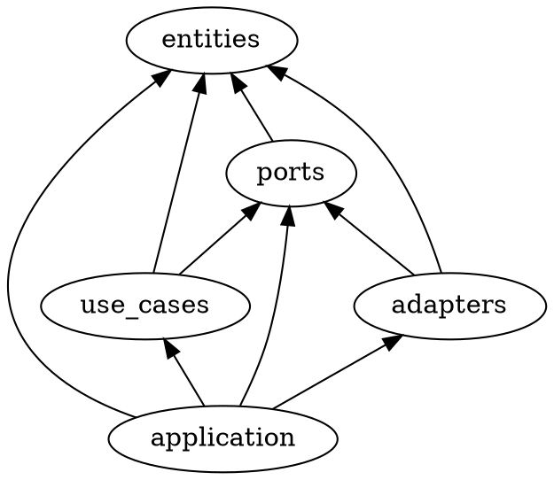

# stamp-rally

## モジュール間の依存関係

## ユースケース

- (WIP) スタンプラリーを作成する (create_stamp_rally)
  - スタンプラリー (StampRally) を作成できる (create_stamp_rally)
  - 将来的に管理者 (Administrator) としてのユーザー (User) を導入する
- 参加する (join)
  - あるユーザー (User) はあるスタンプラリー (StampRally) に参加できる (join)
  - 参加することでユーザー (User) は参加者 (Player) を得られる
