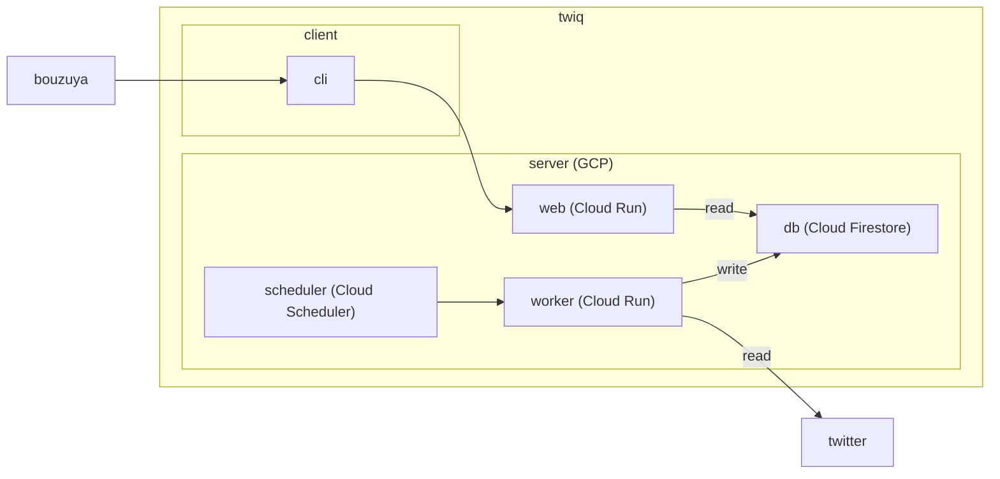

# twiq

自身のツイートを検索する Web アプリケーション。

## TODO

- 設定に従ってツイートを収集する
- 収集したツイートから検索する

## メモ

- 何のためにつくるのか
  - Cloud Firestore の検証
  - 自身のツイートのバックアップの提供
  - 過去のツイートを検索する CLI の提供
    (twilog.org の代替)
- どのようにつくるのか
  - 全体像は構成図を参照
  - 詳細は未定
- 構成要素ごとの役割
  - cli は web に検索クエリを発行する
  - db は情報を保持する
  - scheduler は定期的に worker を動かす
  - web は cli からの呼び出しに応じて db を読み込んで返す
  - worker は twitter から情報を読み込み db に書き込む

## 構成図

