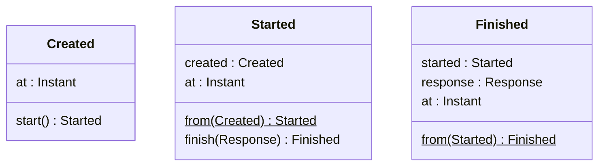
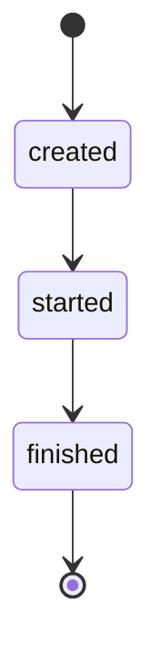

# domain

## メモ

- Twitter にリクエストを投げてレスポンスを保存する
- レスポンスから何を得ておくべきか
- リツイートの扱いをどうすべきか
- 画像の扱いをどうすべきか

```rust
// application layer
let created = request_repository.find_created();
let started = created.start();
request_repository.store(started);

let response = service.send_request(started);

let finished = started.finish(response);
request_repository.store(finished);
```





## モジュール構造

- aggregate ... 集約
  - attr      ... 属性
  - entity    ... エンティティ
  - error     ... エラー
  - event     ... イベント
  - value     ... 値
- event     ... イベント
- value     ... (集約をまたぐ) 値
