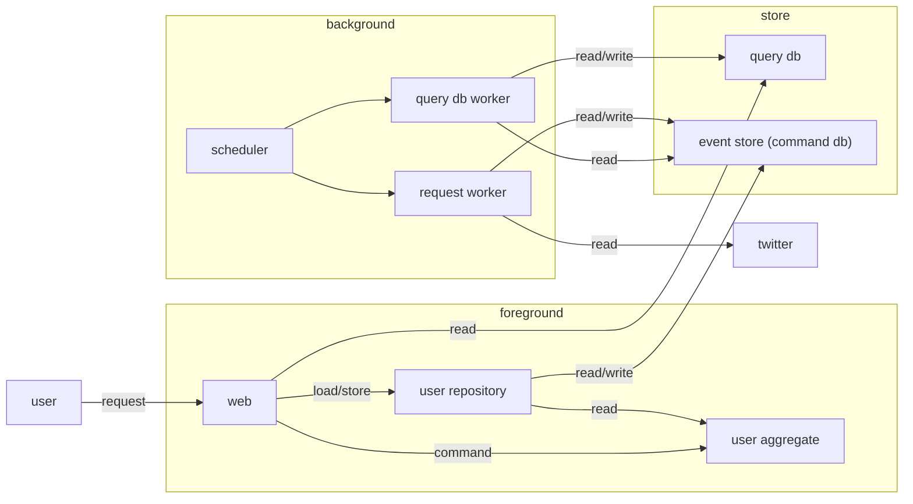
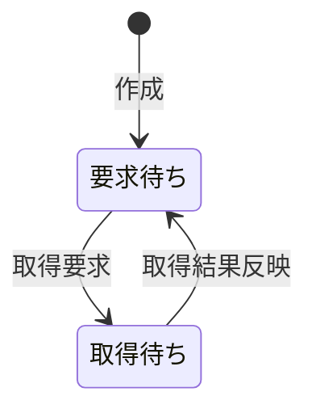

# user の解決

*DEPRECATED*: See [v2](2022-09-08-user-v2.md)

- user の id から name などの情報を取得する

## 構成図

## システム外部へのインタフェース

- `GET /users/:id`
  - status code: 200 OK or 202 Accepted
  - `{"id":"...","name":"...","updated_at":"..."}`
  - 内部処理:
    - 取得済みの情報が query db にあれば 200 でそれを返す、なければ 202 を返す
    - 取得済みの情報がないか updated_at が 86400s よりも前なら次の処理をする
      - user 集約を得る、得られなければ作成する
      - user 集約に取得要求する
      - user 集約を保存する

## user 集約

- 状態:
  - 要求待ち
  - 取得待ち
- 操作:
  - 作成 (user_id)
    - `[*] --> 要求待ち`
  - 取得要求
    - `要求待ち --> 取得待ち`
  - 取得結果反映 (status_code, body)
    - `取得待ち --> 要求待ち`
- 追加 DB:
  - users(user_id (PK), event_stream_id (UK))
    - user_id → event_stream_id の解決のための index
    - event_stream_id → user_id の解決も可能

## query db worker

- ...
- 追加 DB:
  - user_query_db(last_event_id)

## request worker

- ...
- 追加 DB:
  - user_requests(last_event_id)
