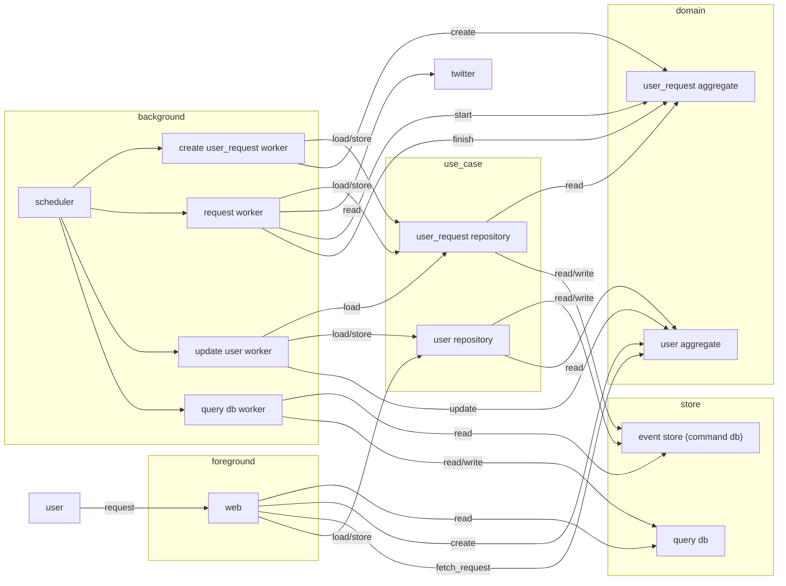
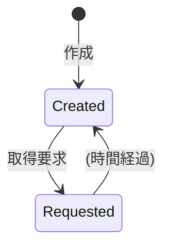
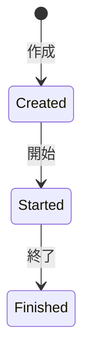

# user の解決 v2

## v1 の問題点

- user aggregate にすべてを入れる関係で response body やそこから変換などが含まれていた
  - user_request aggregate を追加して response body の管理や parse を移動して解決した

## 概要

- user の id から name などの情報を取得する

## 構成図

## システム外部へのインタフェース

- `GET /users/:id`
  - status code: 200 OK or 202 Accepted
  - `{"id":"...","name":"...","updated_at":"..."}`
  - 内部処理:
    - 取得済みの情報が query db にあれば 200 でそれを返す、なければ 202 を返す
    - user 集約を得る、得られなければ作成する
    - user 集約に取得要求する
    - user 集約を保存する

## user 集約

- 操作:
  - 作成 (twitter_user_id) Created
  - 取得要求 (at) FetchRequested
    - 最終取得要求日時から 86400s が経過していない場合はエラー
  - 更新 (twitter_user_name, at) Updated
    - 最終更新日時以降の日時でなければエラー

## user_request 集約

- 操作:
  - 作成 (user_id, twitter_user_id) Created
  - 開始 Started
  - 終了 (status_code, response_body) Finished

## create user_request worker

- UserFetchRequested を監視する
- user_request_id を保持している user_request 集約がなければ作成する

## request worker

- UserRequestCreated を監視する
- user_request_id を保持している user_request 集約を取得する、なければエラー
- 開始状態に更新する、できなければスキップする
  - 既に開始以降の状態ならエラーになる (ここではエラーをスキップする)
- Twitter にリクエストを送信する
- レスポンスで user_request 集約を終了する

## update worker

- UserRequestFinished を監視する
- user_request_id を保持している user_request 集約を取得する、なければエラー
- user_request からレスポンスを取得し parse する (ないし、集約に parse させる)
- 対応する user 集約を取得・更新する

## query db worker

- UserUpdated を監視する
- query db を更新する

## 制約

- UserFetchRequested ユーザーごとで 1 日に 1 回まで
- UserRequestStarted 全体で 1 時間に x 回まで
  - インフラ側で起きないように制御する
  - rate limit error も失敗として UserRequestFinished に記録する
- UserUpdated は更新日時の古くなってしまうものは発行しない
