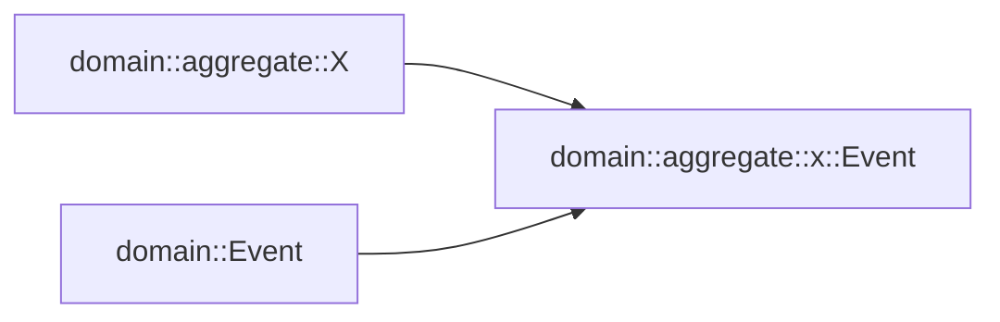

# `impl From<Event> for RawEvent`

## `use event_store_core::Event as RawEvent`

より低レイヤーで動作する型の制限が弱い「生」に近いものという認識から `use event_store_core::Event as RawEvent` としている。

## `impl From<domain::aggregate::x::Event> for RawEvent`

domain crate の Aggregate の下の各 Event に対して、 event_store_core crate の `EventId` `EventStreamId` `EventStreamSeq` を取得するための処理をつけるよりも `event_store_core::Event` への変換をつけて、そこから取り出したほうが良いかもしれないという判断から `impl From<domain::aggregate::x::Event> for RawEvent` としている。

別案 1. `trait RawEventAttrs` としてそれを実装する手もあった。重複がより多くなりそうなので避けた。

別案 2. これらの属性を `domain::Event` に抽出する手もあった。気持ちもある。ただ `domain::aggregate::X` が `domain::Event` に依存するのは想定と違うという判断から避けた。 `domain::aggregate::X` は `domain::aggregate::x::Event` に依存し、 `domain::Event` は `domain::aggregate::x::Event` に依存したい。

想定する依存の方向の図:

また抽出した際に起きる他の問題として `RawEvent::data` の部分だけの型にしてしまうと、そこから `RawEvent` への変換が難しくなる点がある。

`domain::aggregate::x::Event` に抽出するのは↑の問題にはならないので実施するかもしれない。

まだ迷いがある。
