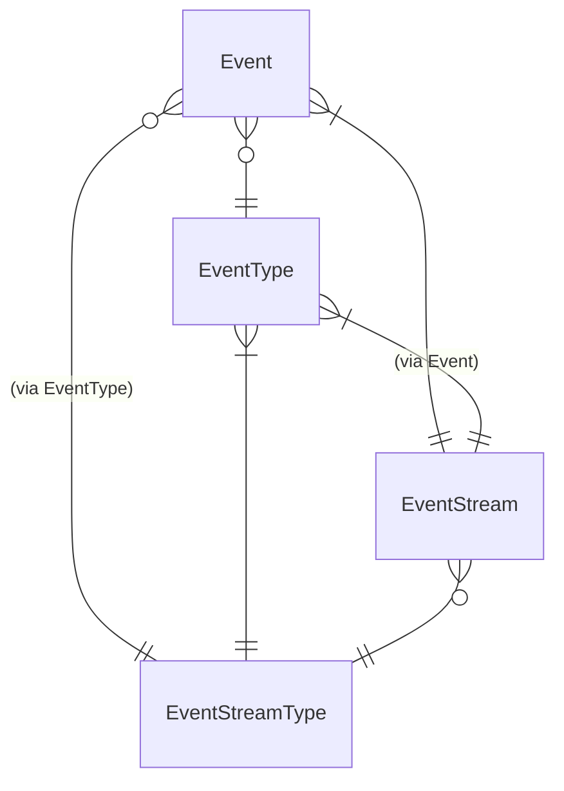

# Event, EventType, EventStream, EventStreamType の ERD

- 注意すべき点は `EventStream` と `EventStreamType` は 1:N になりそうだが 1:1 に制限されている点
- 直感的な対応関係
  - `Event` は aggregate のインスタンスの操作の結果
  - `EventType` は aggregate の操作の結果の種類 (≒操作の種類)
  - `EventStream` は aggregate のインスタンス
  - `EventStreamType` は aggregate
