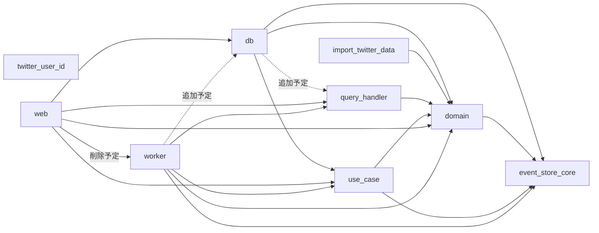

# crate 間の依存関係 2022-10-17

## 気になる点

- `web --> domain` は削除できないか
  - `domain::event` を使用しているため不可
- `worker --> domain` は削除できないか
  - `domain::event` を使用しているため不可
- `worker --> event_store_core` は削除できないか
  - `WorkerRepository` が使用しているため不可
  - `InMemoryWorkerRepository` が使用しているため不可
- `use_case` は `command_handler` にリネームしても良さそう
