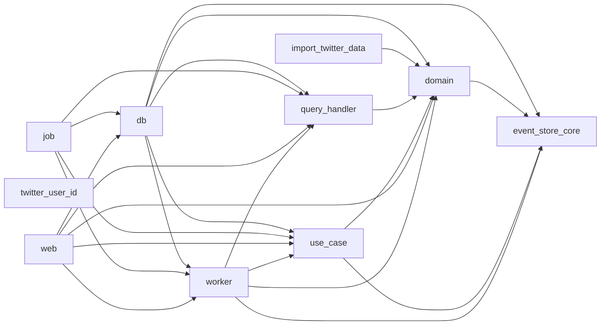

# crate 間の依存関係 2022-11-30

## 気になる点

- `web --> domain` は削除できそう
  - `domain::event` を使用しているため不可→ `use_case` / `worker` で隠せそう
- `job --> domain` は削除できそう
  - `domain::event` を使用しているため不可→ `use_case` / `worker` で隠せそう
- `worker --> domain` は削除できないか
  - `domain::event` を使用しているため不可
- `use_case` は `command_handler` にリネームしても良さそう
- `worker` は `use_case` に統合しても良さそう
